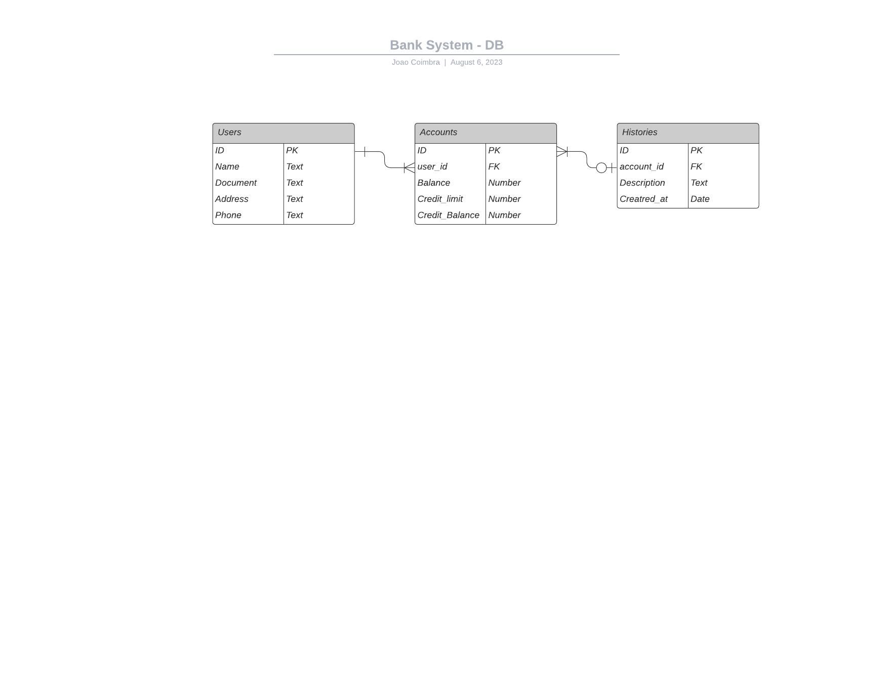

## BANK SYSTEM - KAZAP

## Descrição
Para conclusão do Kazap Academy 2023 foi proposto o desenvolvimento em Ruby de um sistema bancário, para o mesmo foi utilizada a versão 3.0.2p107 da linguagem, também foram utilizadas as Gems ('sequel', '~> 5.70'), ('sqlite3', '~> 1.6', '>= 1.6.3'), ('uuid', '~> 2.3', '>= 2.3.9') e ('rainbow', '~> 3.1', '>= 3.1.1') nas versões descritas.

## Instalação

Clone o repositório do projeto
```bash
    $ git clone #
```

Mude para o diretório do projeto
```bash
    $ cd #
```

Com o terminal aberto, digite o comando para instalar as dependências do projeto
```bash
    $ bundle install
```

Execute também no terminal as migrations para criação do BD
```bash
    $ sequel migrations -m sqlite://db/bank_system.rb
```
Para iniciar o programa podemos executar o seguinte comando no terminal
```bash
    $ ruby app.rb
```

## Documentação das funcionalidades

### Depositar
É possível depositar através do terminal após entrar no menu "Use Bank" escolhendo a opção "1", o depósito irá checar o limite de cheque especial e transferir o restante ao saldo da conta.

### Sacar
Podemos sacar através do terminal após entrar no menu "Use Bank" escolhendo a opção "2", caso o saque seja possível somente com o saldo da conta ele irá apenas retirar o valor da conta, já se ele precisar do cheque especial esse valor será removido do limite e posteriormente cobrado em novos depósitos.

### Transferir
Para transferir através do terminal é necessário entrar no menu "Use Bank" escolhendo a opção "3", é necessário informar o ID da conta de origem, o ID da conta de destino e o valor a ser transferido, será realizado internamente então um saque (mantendo as validações de limite) a conta de origem e um depósito a conta de destino, caso a transferência gere taxa esse valor será considerado no saque a conta de origem.

### Consultar saldo
Podemos consultar o saldo de determinada conta acessando o menu "Use Bank" e escolhendo a opção "4", é necessário informar o ID da conta para consulta, ela retornará o saldo atual e o limite do cheque especial (-100 como padrão).

### Histórico das transações
Para gerar o histórico das transações devemos entrar em "Use Bank" e selecionar a opção "5", ela irá retornar no terminal as ultimas 5 transações e exportar as mesmas informações em um arquivo JSON de nome ("ID DA CONTA" - history) na pasta history em assets.

### Saidas
Para retornar ao menu inicial a partir do menu "Use Bank" podemos digitar a opção "0", já para encerrar o programa podemos utilizar a opção "4" do menu inicial.


### Menu de criação de clientes/contas

#### Criar usuários
Para criar contas podemos escolher a opção "1" do menu inicial e informar os dados do cliente que irão passar por validações como:  validações de presença (nome, documento, endereço, telefone) e validação de unicidade (documento).

#### Criar Contas
Para criar contas devemos escolher a opção "2" do menu inicial e informar o ID do cliente a qual a conta pertencerá.

#### Excluir contas
Para excluir contas devemos acessar o menu "Use Bank" e a opção "6", será solicitado o ID do usuário, caso informado seram deletados o usuário e suas respectivas contas.


### Diagrama do banco de dados
Foram criadas 3 tabelas, Users e Accounts e Histories.
